# Generic Chinese water quality sensor

- [Generic Chinese water quality sensor](#generic-chinese-water-quality-sensor)
  - [Datasheet](#datasheet)
  - [Sample code](#sample-code)
  - [Teardown](#teardown)

There's practically no unique identification on this unit, but it's a pretty common/generic design.
There are several sellers that offer this unit so it's hard to say who the original manufacturer is.
All of the listings feature an image like this:


## Datasheet

I ordered a pH/ORP sensor, but there seller sent me the [datasheet](_docs/pH_EC%20Sensor.pdf) for the pH/EC variant.
I am pretty sure that the internals are basically the same and it's just the software/probe that's different.

In any case, the modbus / protocol data from the attached datasheet works for me with my pH/ORP sensor.

## Sample code

Using [poetry](https://python-poetry.org/) or another virtual environment manager, install the dependencies and then run the script.

```shell
❯ ./src/basic.py
2024-08-23 20:46:58 [error    ] Starting basic.py
MinimalModbus debug mode. Create serial port /dev/ttyUSB0
MinimalModbus debug mode. Will write to instrument (expecting 7 bytes back): 01 03 00 00 00 01 84 0A (8 bytes)
MinimalModbus debug mode. Clearing serial buffers for port /dev/ttyUSB0
MinimalModbus debug mode. No sleep required before write. Time since previous read: 8648767.24 ms, minimum silent period: 4.01 ms.
MinimalModbus debug mode. Response from instrument: 01 03 02 02 42 39 15 (7 bytes), roundtrip time: 0.0 ms. Timeout for reading: 0.0 ms.

MinimalModbus debug mode. Will write to instrument (expecting 7 bytes back): 01 03 00 01 00 01 D5 CA (8 bytes)
MinimalModbus debug mode. Clearing serial buffers for port /dev/ttyUSB0
MinimalModbus debug mode. Sleeping 3.87 ms before sending. Minimum silent period: 4.01 ms, time since read: 0.14 ms.
MinimalModbus debug mode. Response from instrument: 01 03 02 00 33 F8 51 (7 bytes), roundtrip time: 0.0 ms. Timeout for reading: 0.0 ms.
2024-08-23 20:46:58 [info     ] Readings:                      orp=51 pH=5.78
```

## Teardown

Nothing about the unit is particularly difficult to access so this is a pretty straight forward teardown.
The unit is held together with some hot snot and a few philips screws.

The unit sips power.
Depending on which source you consult, the unit supports between 7 and 24V but I was able to power it with 5V.

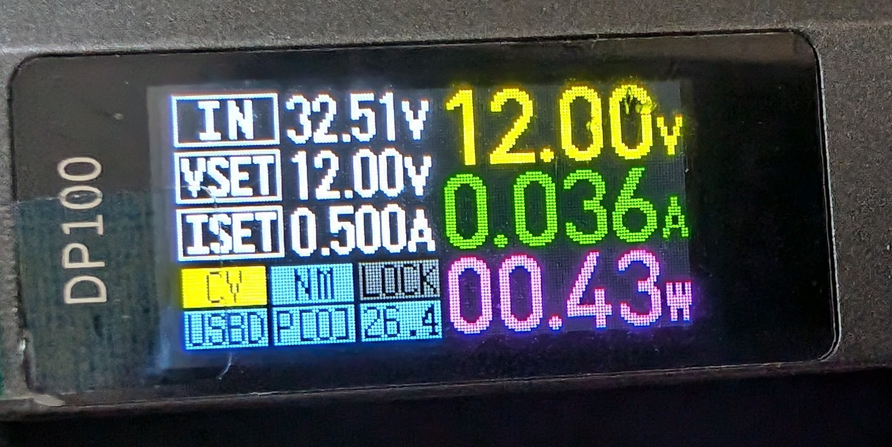

Label tells you everything _except_ who the manufacturer is.

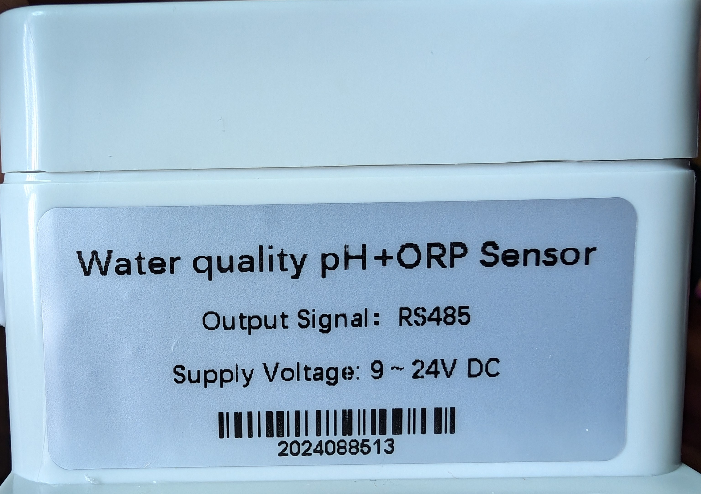

Beyond that, just philips screws holding the unit together.

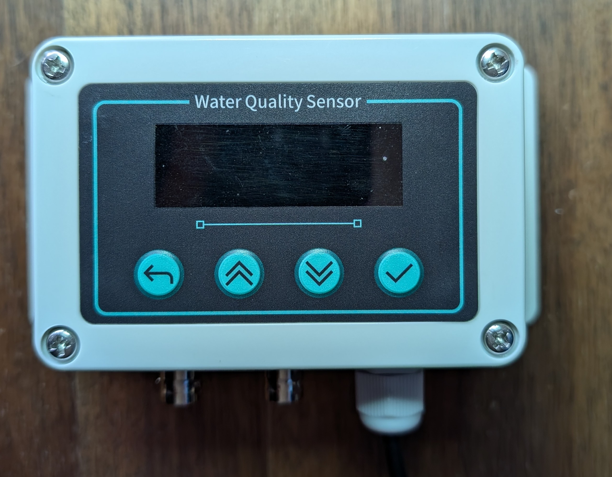

Front panel isn't anything special.
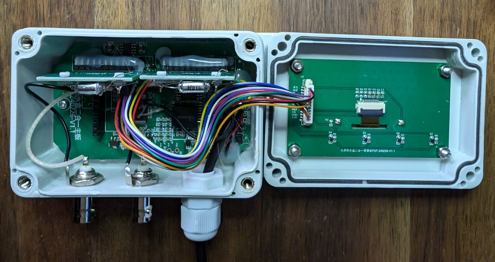

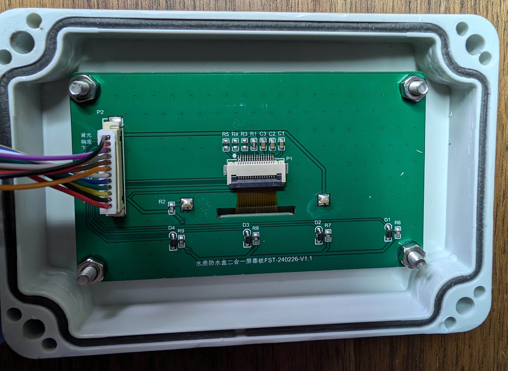

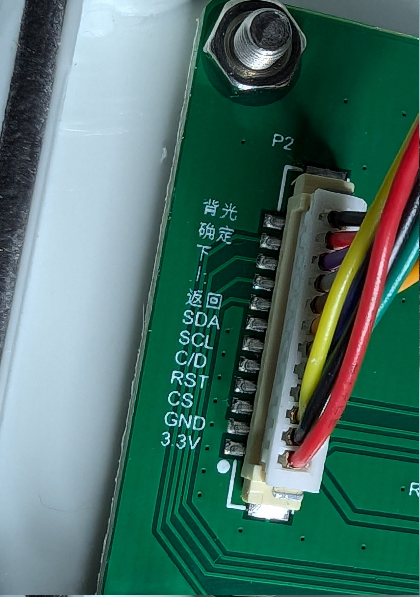

The main PCB seems designed to accommodate a few different sensors as there are a few unpopulated headers / footprints.

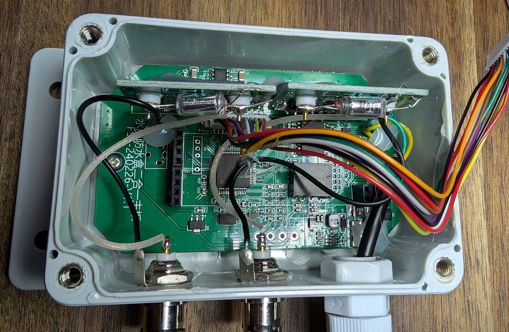

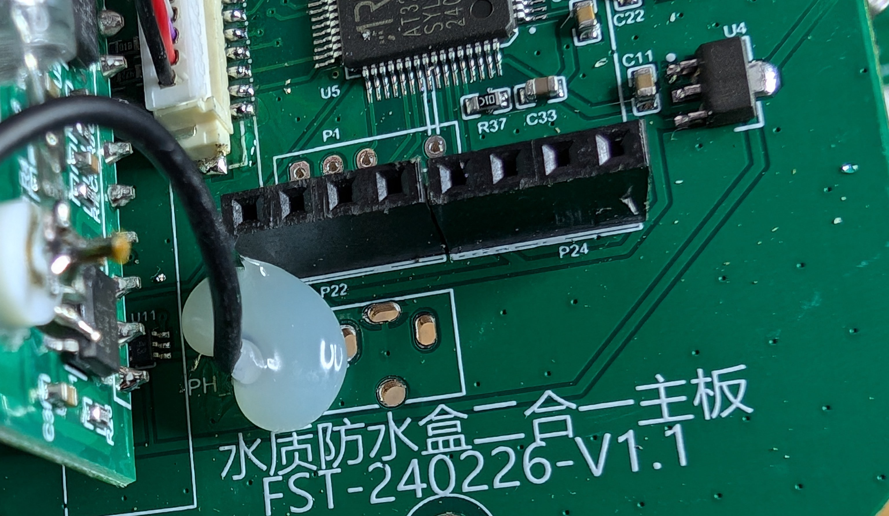

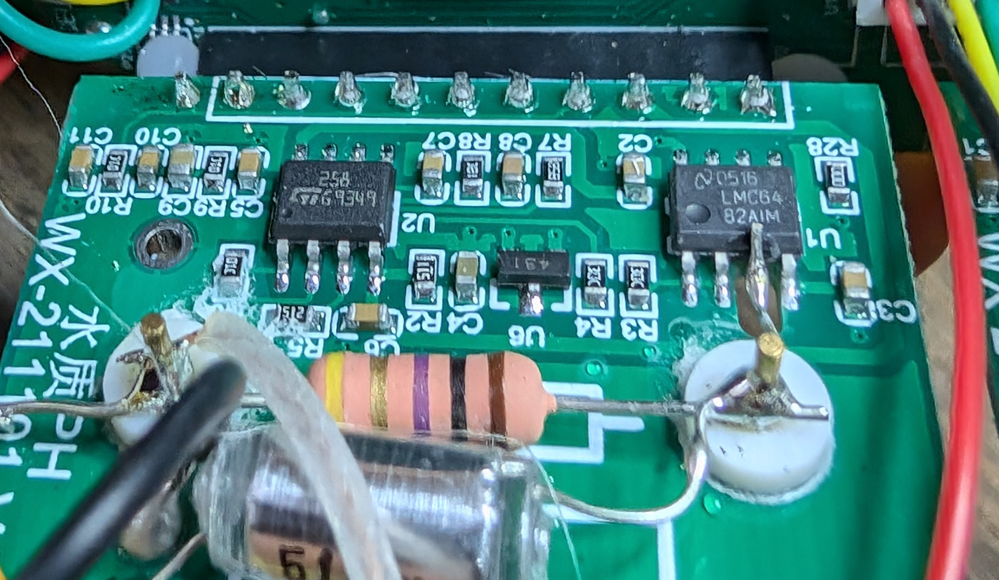

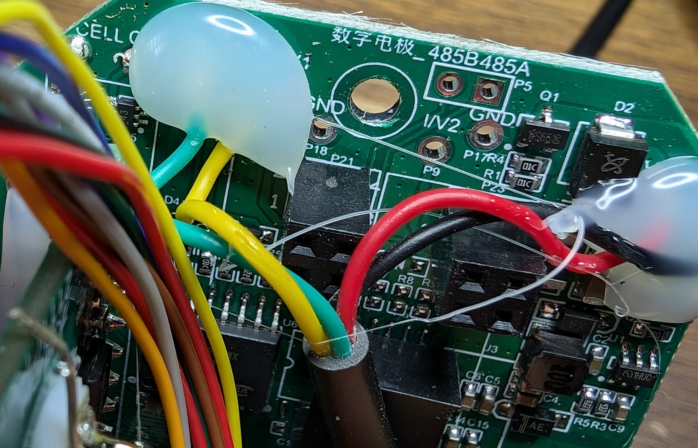

There's a STM32 clone running the show.
Almost certainly the 4 pins next to it are a UART/Programming header.
No, I didn't try to connect to it.

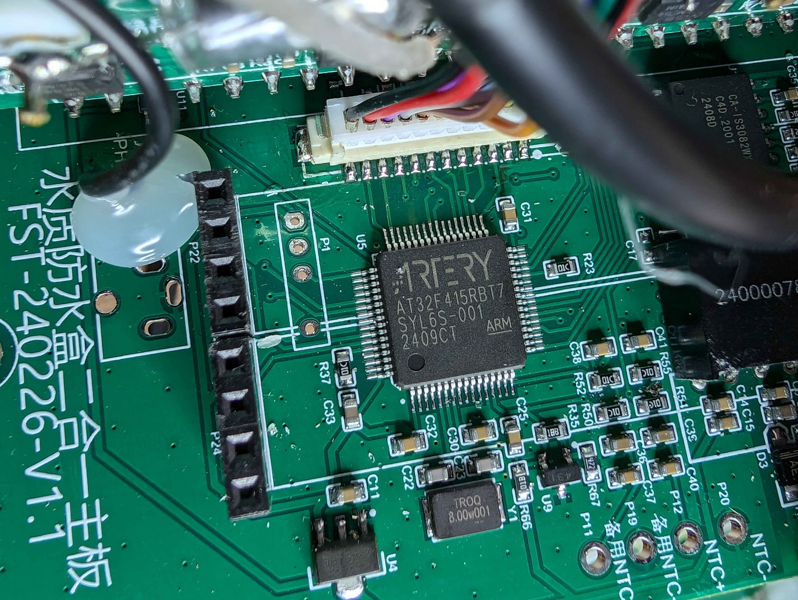

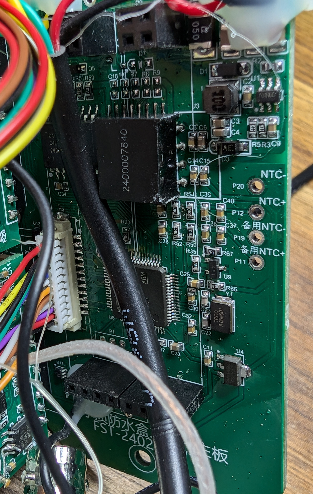

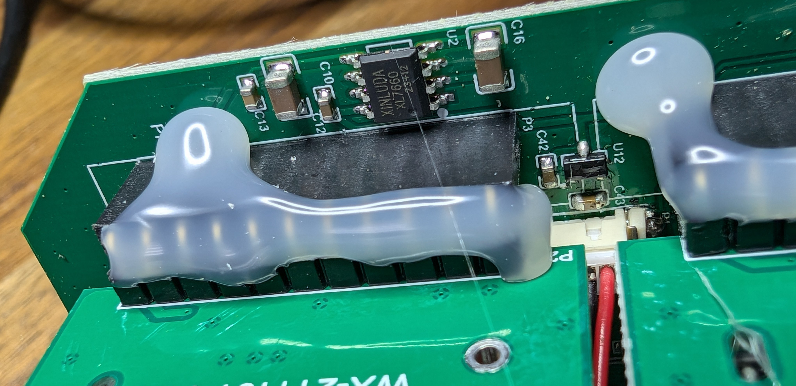

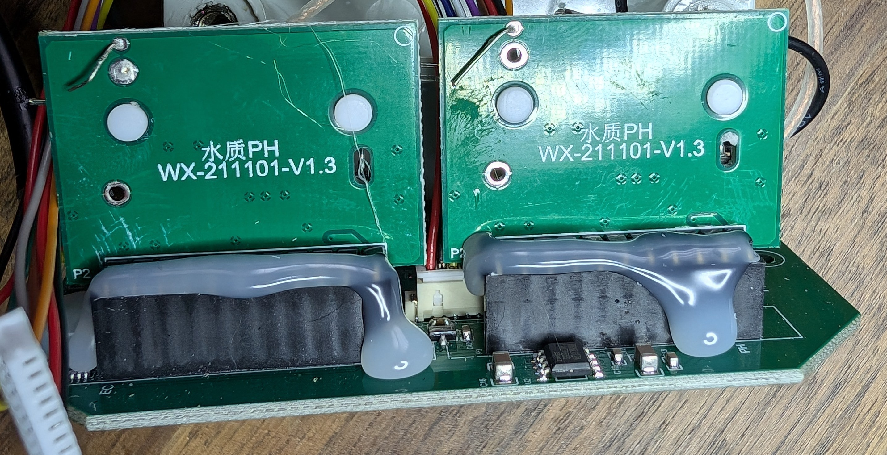

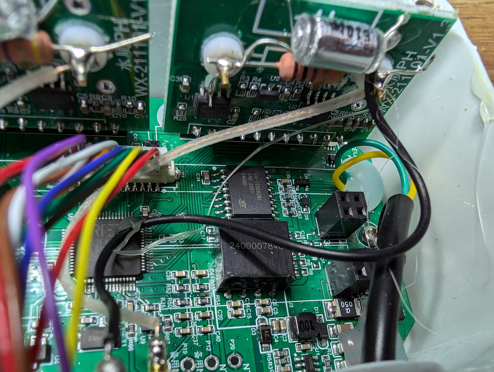
